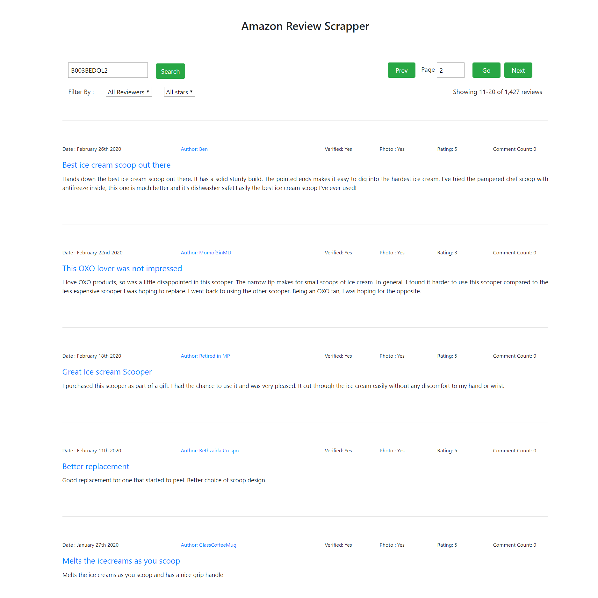

Simple Amazon Review Scrapper based on ASIN

I create 2 backend version :

1. Node.js Server: 

```

configure database config on \app\config\env.js

$ npm install
$ npm run start

```

2. Laravel 7

```

copy .env.example to .env and adjust your database config on .env file

$ composer install
$ php artisan key:generate
$ php artisan migrate --seed
$ sudo chmod 777 storage/ -R            # if using linux
$ php artisan serve

```

note : only 1 backend can run in same time because using same port 8000


Vue.js Frontend: 

```

$ npm install
$ npm run serve

Open Browser with Url: http://localhost:4200/

```




Todo : 
- Database interaction
- Queue / Asynchronous Task
- Cron job

