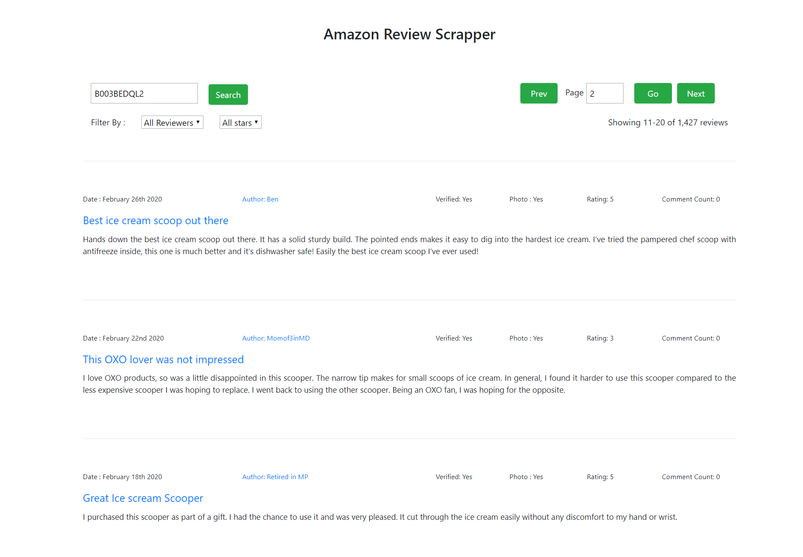

Simple Amazon Review Scrapper based on ASIN

I create 2 backend version :

1. Node.js Server: 

- configure database config on \app\config\env.js
- npm install
- npm start

2. Laravel 7

- composer install
- copy .env.example to .env and adjust your database name on .env file
- run php artisan key:generate
- run php artisan migrate --seed
- run php artisan serve

note : only 1 backend can run in same time because using same port 8000

Vue.js Frontend: 

- npm install
- npm run serve
- Open Browser with Url: http://localhost:4200/

Todo : 
- Database interaction
- Queue Task
- cron job

